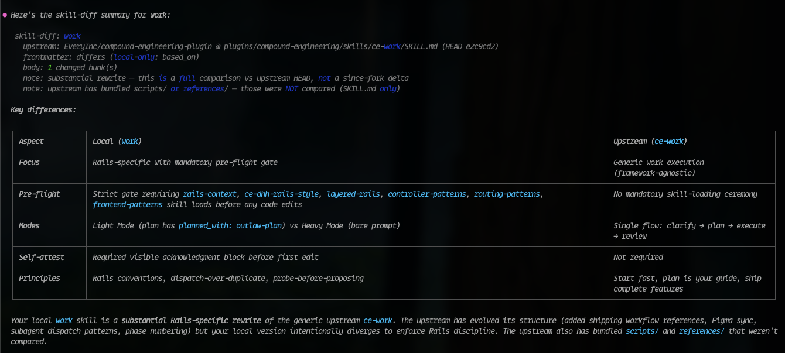

# outlaw-skills

A multi-harness skill pipeline & my personal customization layer atop the growing pile of excellent open-source skills that I use & appreciate, ***but also disagree with at one level or another*** 😉

## Skill Diff

Enables comparisons of the upstream version of forked skills in this repo.

e.g. /work


## Quick start

The `dist/plugin/` directory holds a prebuilt plugin consumed by both Claude Code and GitHub Copilot CLI. It is not on any official marketplace, so clone this repo and install from its local marketplace manifest. Rebuild with `bin/build` if you change anything under `src/`.

```sh
bin/build   # builds the single dist/plugin/ tree
```

Wire the built distribution into your tools — both install from `dist/plugin/` via their own marketplace manifest:

- **Claude Code:** in any session, run `/plugin marketplace add /absolute/path/to/outlaw-skills` then `/plugin install outlaw-skills@outlaw-skills`, and restart.
- **GitHub Copilot CLI:** `copilot plugin marketplace add /absolute/path/to/outlaw-skills` then `copilot plugin install outlaw-skills@outlaw-skills`. Copilot reads the open Agent Skills (`SKILL.md`) format natively, so skills are copied verbatim — no conversion — and auto-activate by description.

Full install details, the hook caveat, and the verification checklist live in [AGENTS.md](AGENTS.md).

## Releasing & updating

Cut a release with `bin/release` (bumps `VERSION`, syncs both marketplace manifests, rebuilds `dist/plugin/`, runs tests, tags `vX.Y.Z`, pushes, and creates a GitHub release):

```sh
bin/release patch        # or: minor | major
bin/release --dry-run    # preview without changing anything
```

Claude Code caches the plugin by version, so a bare `bin/build` rebuild won't refresh a running install — you must bump the version with `bin/release`, then run `/plugin update outlaw-skills@outlaw-skills` (or relaunch). See [AGENTS.md](AGENTS.md#release) for preconditions and flags.

## Running the tests

The test suite is plain Minitest with no Gemfile or Rakefile:

```sh
minitest
```

Tests cover the build pipeline, the single-tree output (skills, agents, hooks), build idempotency, and the release version-sync invariant.

## License

MIT. See [LICENSE](LICENSE).
